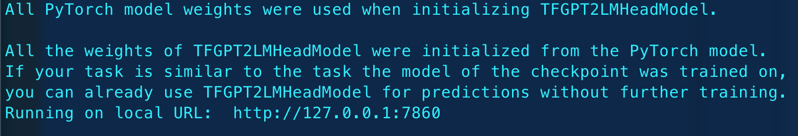
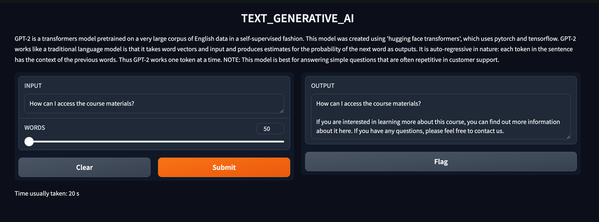

# TEXT_GENERATIVE_AI
---
This project was made as a part of the Summer Analytics course 2024 organized by IIT Guwahati's Consulting and Analytics club.
The repository contains the following files:
1. Test.ipynb - A jupyter notebook used for learning purposes.
2. app.py - The main project
  
## Execution:
The project uses the graphical user interface provided by Gradio. To execute, run the app.py file and the project will be hosted on a local port.  
 
The output result looks like this:
